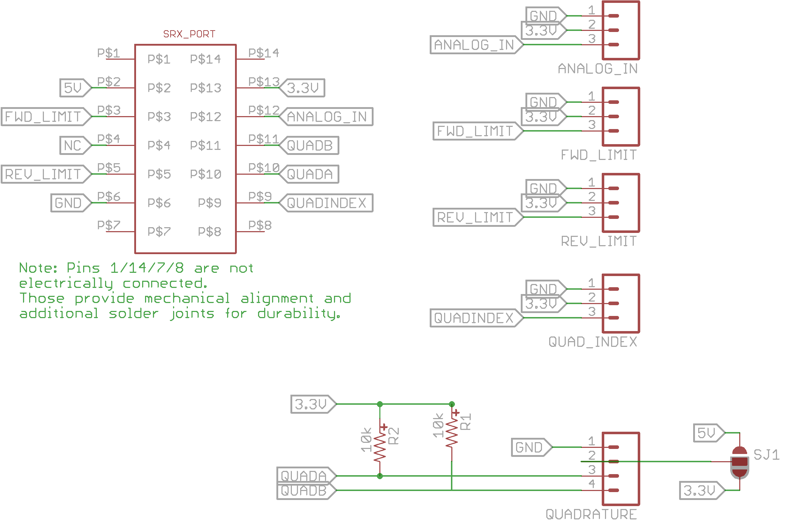
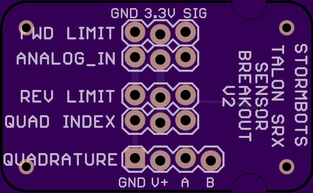
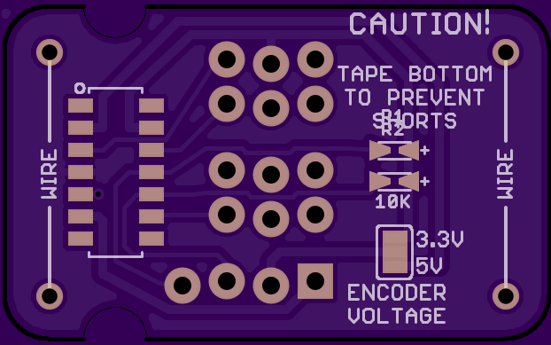

# SRX CAN Plugboard
 
# Description
Provides a spring plug for the SRX for connecting to the CAN network, similar to the other 2015 control system devices

# FRC Regulations
This is a passive device

#Schematic

#PCB Top
 

#PCB Bottom!

 