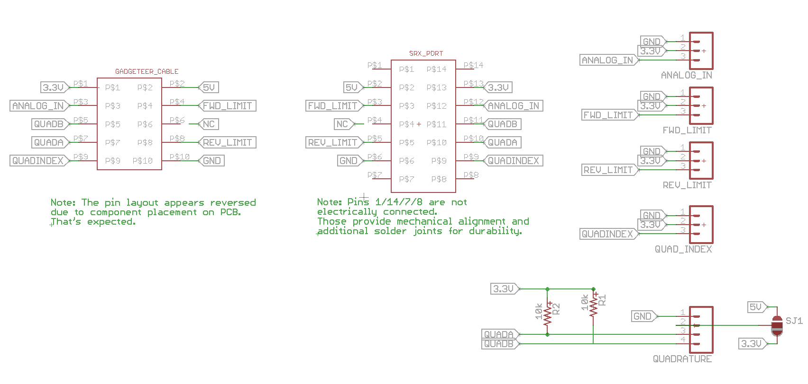
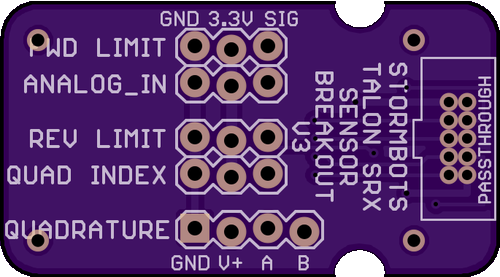
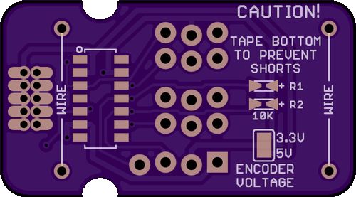

# Talon SRX Dataport Breakout with passthrough
 
# Description
This board breaks out the Talon SRX pins into a more easily usable 3-wire configuration that's compatible with standard servo cabling.

This version also includes a 1-1 passthrough for use with existing Gadgeteer devices by CTRE

# FRC Regulations
This is a passive device

#Schematic

#PCB Top
 

#PCB Bottom!

 